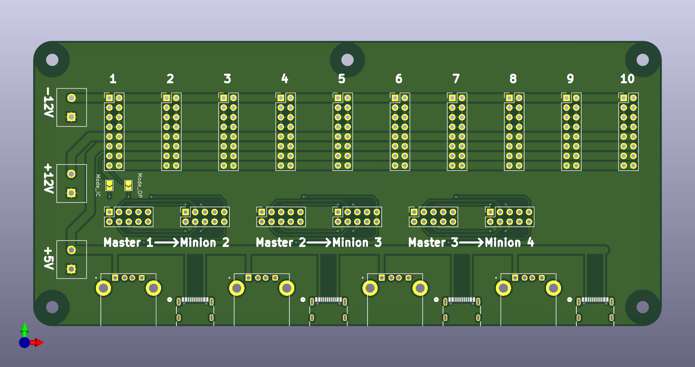
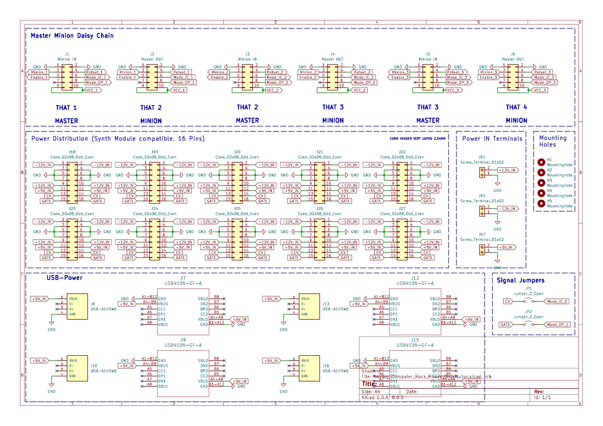

# Power distrubution board for analog computer rack modules
---

This PCB is a Power-Distribution Board for self designed analog computing modules and are compatilbe with the [THE ANALOG THING (THAT)](https://the-analog-thing.org/) of the [Anabrid](https://anabrid.com/) company. It supplies power, in 16-pin headers, compatible with normal synthezier modules. The **CV** and **Gate** lines can be used as **Mode IC** and **Mode OP** signals to connect the THAT with custom analog cumputing modules. \
Multiple THAT Modules can be daisy chained together through connections on the board. The **Master 1** input supplies the signals **Mode IC** and **Mode OP** which can be connected though jumpers to connected analog computing modules.

---
## PCB render

---
## Schematic

